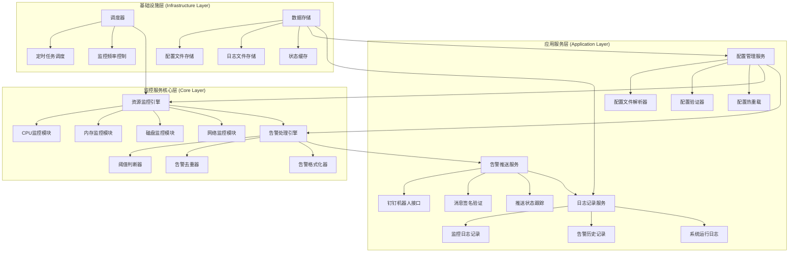

# 服务器资源监控钉钉告警系统 - 产品开发文档

## 一、产品功能架构图



## 二、架构核心解读

### 整体设计思路
采用经典的三层架构模式，将系统划分为监控服务核心层、应用服务层和基础设施层。核心层专注于资源监控和告警逻辑，应用层处理配置管理、消息推送和日志记录，基础设施层提供调度和存储支撑，确保系统的可扩展性、可维护性和高可用性。

### 模块职责详解

* **监控服务核心层**:
  * **资源监控引擎**: 系统的心脏模块，负责实时采集服务器各项资源指标，包括CPU使用率、内存占用、磁盘空间、网络流量等关键指标
  * **告警处理引擎**: 智能告警处理中心，实现阈值判断、重复告警过滤、告警信息格式化等核心告警逻辑

* **应用服务层**:
  * **配置管理服务**: 统一管理系统配置，支持配置文件热重载，确保钉钉Webhook、加密secret、监控参数等配置的灵活管理
  * **告警推送服务**: 专门处理钉钉机器人消息推送，包含消息签名、推送状态跟踪等功能，保证告警消息的可靠送达
  * **日志记录服务**: 完整的日志体系，记录监控数据、告警历史和系统运行状态，便于问题排查和运营分析

* **基础设施层**:
  * **调度器**: 精确控制监控任务的执行频率和时机，支持灵活的调度策略
  * **数据存储**: 提供配置、日志、状态等数据的持久化和缓存服务

## 三、分阶段行动计划

### 第一阶段 (MVP - 最小可行产品)
**目标**: 验证核心监控告警功能，快速实现基础需求

**关键功能**:
- 基础资源监控（CPU、内存使用率监控）
- 简单阈值判断和告警触发
- 钉钉机器人基础消息推送
- 基础配置文件支持（YAML/JSON格式）
- 简单的命令行启动和日志输出

**技术实现要点**:
- 使用 `psutil` 库获取系统资源信息
- 实现基础的钉钉Webhook API调用
- 简单的配置文件解析和验证

### 第二阶段 (核心版 - 功能完善)
**目标**: 完善监控体系，提升告警准确性和系统稳定性

**关键功能**:
- 扩展监控指标（磁盘使用率、网络IO、进程监控）
- 智能告警去重和频率控制机制
- 配置文件热重载功能
- 告警历史记录和查询
- 系统健康检查和自监控
- 告警消息模板化和自定义

**技术增强**:
- 实现告警状态机制，避免重复告警
- 添加配置文件变更监听
- 完善日志分级和轮转机制
- 增加系统异常处理和恢复机制

### 第三阶段 (完整版 - 企业级功能)
**目标**: 构建企业级监控解决方案，支持多场景应用

**关键功能**:
- 多服务器集群监控支持
- 告警规则引擎和复杂阈值策略
- 多渠道告警推送（钉钉、邮件、短信等）
- 监控数据可视化面板
- 告警统计分析和报表
- API接口和第三方系统集成
- 告警升级和值班管理

**架构升级**:
- 微服务架构改造
- 分布式监控数据收集
- 消息队列引入提升推送可靠性
- 数据库存储支持复杂查询分析

---

## 产品信息

* **产品名称**: Monitor4DingTalk (服务器资源监控钉钉告警系统)
* **核心价值**: 提供7×24小时服务器资源监控，及时发现系统异常并通过钉钉机器人推送告警信息，保障业务系统稳定运行，降低运维成本
* **目标用户**: 
  * 运维工程师和系统管理员
  * 中小企业IT团队
  * 开发团队的DevOps实践者
* **功能列表**:
  * CPU使用率实时监控
  * 内存占用率监控
  * 磁盘空间使用监控  
  * 网络IO流量监控
  * 自定义阈值配置
  * 钉钉机器人告警推送
  * 告警去重和频率控制
  * 配置文件热重载
  * 监控日志记录
  * 告警历史查询
  * 系统健康自检
  * 多级告警策略

## 四、技术架构选型

### 开发语言
- **Python 3.8+**: 丰富的系统监控库支持，开发效率高，易于维护

### 核心依赖库
- **psutil**: 系统资源监控核心库
- **PyYAML**: 配置文件解析
- **requests**: HTTP请求处理
- **schedule**: 任务调度
- **logging**: 日志处理
- **hashlib/hmac**: 钉钉消息签名

### 项目结构设计
```
monitor4dingtalk/
├── src/
│   ├── __init__.py
│   ├── core/                 # 核心监控模块
│   │   ├── __init__.py
│   │   ├── monitor.py        # 资源监控引擎
│   │   └── alert.py          # 告警处理引擎
│   ├── services/             # 应用服务层
│   │   ├── __init__.py
│   │   ├── config.py         # 配置管理服务
│   │   ├── dingtalk.py       # 钉钉推送服务
│   │   └── logger.py         # 日志记录服务
│   ├── utils/                # 工具模块
│   │   ├── __init__.py
│   │   └── scheduler.py      # 调度器
│   └── main.py               # 程序入口
├── config/
│   └── config.yaml           # 配置文件
├── logs/                     # 日志目录
├── tests/                    # 测试目录
├── requirements.txt          # 依赖管理
├── README.md                 # 项目说明
└── product-development-plan.md  # 产品开发文档
```

这个架构设计遵循了模块化、可扩展、易维护的原则，既能快速实现MVP版本验证需求，又为后续功能扩展预留了充足空间。建议按照三阶段计划逐步实施，确保项目的稳步推进和持续价值交付。 